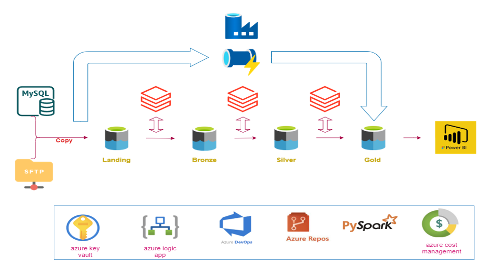

# Azure End to End Supply Chain Data Engineering Project
This Supply Chain Data Analytics project employs the Medallion Architecture to ensure a structured, scalable, and efficient data pipeline using Azure's ecosystem. By integrating MySQL, Azure Data Lake Storage Gen2, Azure Data Factory, Databricks, and Power BI, the project facilitates seamless data ingestion, transformation, and visualization, enabling actionable insights for optimizing supply chain operations and improving business decision-making.

# Objective of the Project
The goal is to develop an Azure-based solution that ingests data from SFTP and on-premise databases like MySQL, migrating it to the Azure cloud. This is achieved by creating an ETL pipeline utilizing Azure Key Vault, Azure Data Factory, and Azure Databricks.

This solution can be integrated with a visualization and reporting dashboard through Microsoft Power BI.

Data migration to the cloud is a key challenge that data engineers often tackle when developing solutions for small to medium-sized organizations. Working on this project allowed me to refine and enhance my skills in the following areas:
- Designing and implementing ETL pipelines using Azure Data Factory
- Integrating on-premise databases (MySQL) and SFTP with Azure cloud services
- Utilizing Azure Key Vault for secure data management
- Working with Azure Databricks for data transformation and processing
- Visualizing and reporting data with Power BI

# Prerequisites:
1. MySQL Workbench
2. SFTP server on Windows 10
3. Azure Subscription (Azure Data Lake Storage Gen2, Azure Data Factory, Azure Key Vault, Azure Databricks, Microsoft Entra ID)
4. Microsoft Power BI
5. Create Database and user. Manage user credentials as Secrets in Azure Key Vault

# Implementation
## Part 1: Data Ingestion
- **MySQL to ADLS Gen2**
1. Create database: fmcg(Fast moving consumer goods)
   
   

2. Setup the Microsoft Integration Runtime between Azure and the On-premise MySQL Workbench
3. Create a Copy Pipeline to load the data from local on-premise server into Azure Data Lake Storage Gen2 "**bronze**" directory
 
   

4. Data is stored in "Parquet" format in ADLS Gen2 storage folders

## Part 2: Data Transformation 

The data is ingested into Azure Databricks, where PySpark notebooks are used for processing. Databricks automatically manages cluster nodes and compute resources. The data undergoes a two-stage transformation process: it is first cleaned and refined from Bronze (raw data) to Silver (enriched and transformed data), and then further processed from Silver to Gold (curated, high-quality data ready for analysis).
1. During the Bronze to Silver transformation, we remove duplicates, apply appropriate column datatype conversions, and move the cleaned data from the Bronze folder to the Silver folder.
2. In the Silver to Gold transformation, we rename attribute names to ensure consistent naming conventions across the dataset. The final, refined data is then moved to the Gold folder.

The final Gold-level data, stored in Delta format, is optimized for business reporting and dashboard visualizations. It is curated, clean, and ready for analysis to support decision-making.

Launch Azure Databricks and run transformations using these notebooks: bronze to silver and silver to gold

## Part 3: Data Loading

Load the gold level data and run the pipeline.

- Pipeline retrieves the Table Names from the gold folder.
- For each table, A Stored Procedure is executed which creates and updates View in Azure SQL Database.

## Part 4: Triggers and Email Notifications

## Part 5: Data Reporting
Finally, load the data from the views using Microsoft Power BI. The Data is retrieved using DirectQuery to automatically run and update from the Cloud Pipelines.

An Interactive Dashboard is created to showcase the supply chain customer order figures

   

